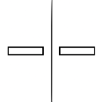

# Multi AI Prompter

A Chrome extension that allows you to compare responses from multiple AI chatbots side-by-side in a split-screen view.



## Demo

Watch the extension in action:

[](https://www.youtube.com/watch?v=NwKbdyDHUoE)

## Features

- Compare responses from ChatGPT, Claude, Gemini, and Grok simultaneously
- Send the same prompt to all supported AI platforms with one click
- Easily switch between different AI combinations
- Save time by avoiding the need to open multiple tabs or windows
- Perfect for research, content creation, programming help, and learning

## Installation

### From Chrome Web Store

1. Visit the Multi AI Prompter page on the Chrome Web Store
2. Click "Add to Chrome"
3. Confirm the installation when prompted

### Manual Installation (Developer Mode)

1. Download or clone this repository
2. Open Chrome and navigate to `chrome://extensions`
3. Enable "Developer mode" in the top right corner
4. Click "Load unpacked" and select this directory
5. The extension should now be installed and visible in your browser

## How to Use

1. Click the Multi AI Prompter icon in your browser toolbar
2. Select which AI services you want to compare
3. Enter your prompt in the input field
4. Click "Send to All" to send the prompt to all selected AI services
5. View the responses side-by-side in the split-screen view

## Supported AI Services

- [ChatGPT](https://chat.openai.com)
- [Claude](https://claude.ai)
- [Gemini](https://gemini.google.com)
- [Grok](https://grok.com)

## Privacy

Multi AI Prompter does not collect, store, or transmit any personal data. All interactions happen directly between your browser and the AI services. See our [Privacy Policy](PRIVACY.md) for more details.

## Development

### Prerequisites

- Node.js (v14 or higher)
- npm or yarn

### Setup

```bash
# Install dependencies
npm install
```

### Build the Extension

```bash
# Create a production build
npm run build
```

### Development Mode

```bash
# Start development build with watch mode
npm run dev
```

## Project Structure

```
├── assets/             # Static assets like icons
├── dist/               # Built extension files (created after build)
├── src/                # Source files
├── background.js       # Background script
├── content.js          # Content script
├── manifest.json       # Extension manifest
├── options.html        # Options page
├── options.js          # Options page script
├── options.css         # Options page styles
├── popup.html          # Popup UI
├── popup.js            # Popup script
├── popup.css           # Popup styles
├── split-search.html   # Split-screen view
├── split-search.js     # Split-screen script
└── README.md           # This file
```

## Contributing

Contributions are welcome! Please feel free to submit a Pull Request.

## License

MIT

## Contact

If you have any questions or suggestions, please open an issue on GitHub or contact us at [Your Contact Email].
